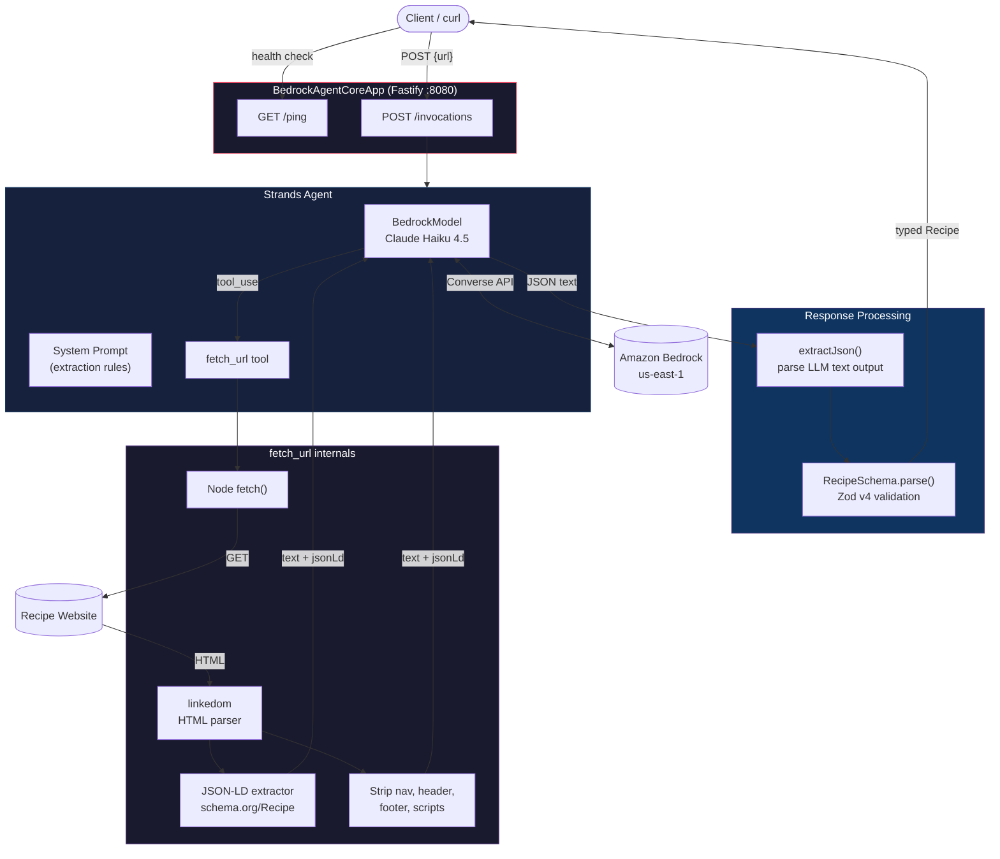
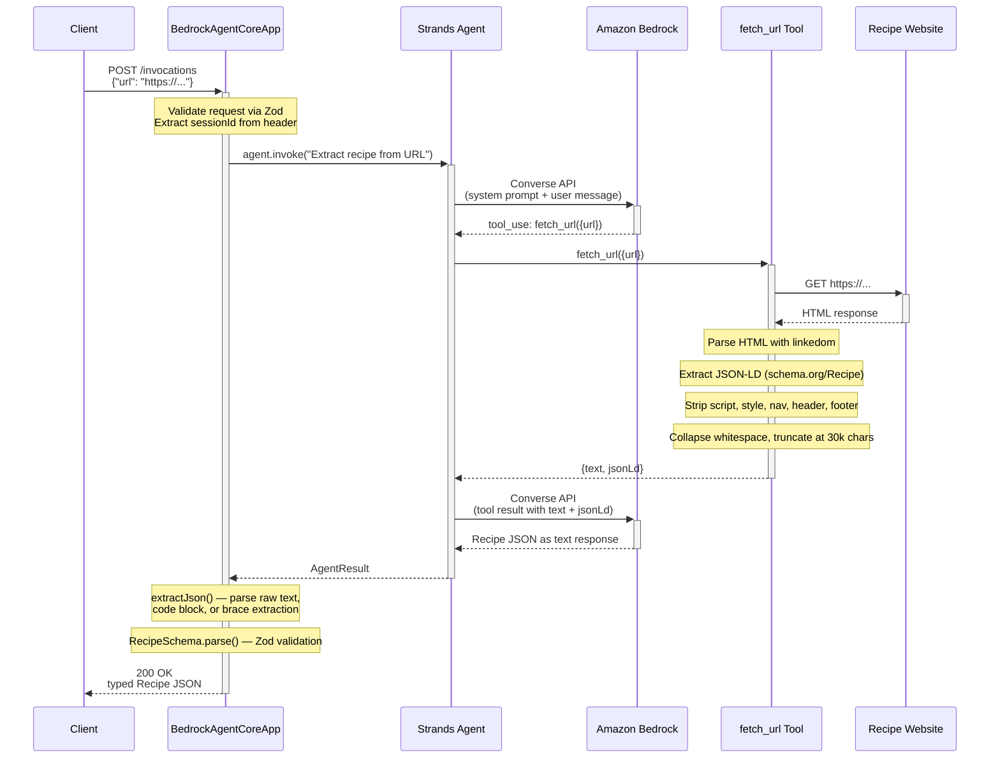

# Architecture

## System Overview

## Request Flow

## Key Design Decisions

| Decision | Rationale |
|---|---|
| **Non-streaming handler** | Returns single JSON object — structured data doesn't benefit from SSE streaming |
| **`agent.invoke()` + JSON parse** | `structuredOutputSchema` is typed in the SDK but docs say "not supported in TypeScript" — manual parse is reliable |
| **`extractJson()` fallback chain** | LLM may wrap JSON in markdown code blocks; tries direct parse → code block regex → brace extraction |
| **JSON-LD extraction** | Many recipe sites embed `schema.org/Recipe` structured data — passing it alongside page text improves accuracy |
| **linkedom over jsdom** | ~200KB vs ~70MB; sufficient for text extraction and DOM traversal |
| **Claude Haiku 4.5** | Fast, cheap, accurate enough for structured extraction — ~5-9s per request |
| **temperature: 0** | Deterministic output for consistent JSON formatting |
