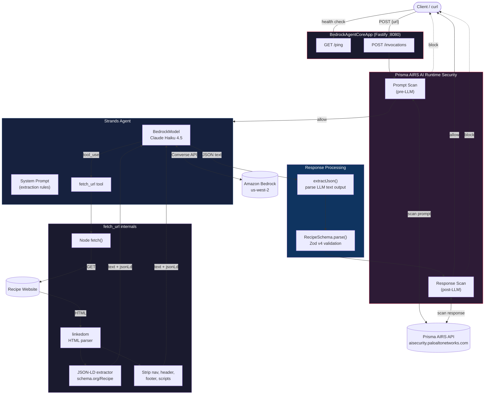

# Architecture Overview

## System Diagram



## Request Flow

```mermaid
sequenceDiagram
    participant C as Client
    participant App as BedrockAgentCoreApp
    participant AIRS as Prisma AIRS API
    participant A as Strands Agent
    participant B as Amazon Bedrock
    participant T as fetch_url Tool
    participant W as Recipe Website

    C->>+App: POST /invocations<br/>{"url": "https://..."}
    Note over App: Validate request via Zod<br/>Extract sessionId from header

    rect rgb(45, 27, 54)
        Note over App,AIRS: Pre-LLM Security Scan
        App->>+AIRS: scanPrompt(prompt, sessionId)
        AIRS-->>-App: {action: "allow" | "block"}
    end

    alt AIRS blocks prompt
        App-->>C: 200 {error: "blocked", category, scan_id}
    else AIRS allows prompt
        App->>+A: agent.invoke("Extract recipe from URL")

        A->>+B: Converse API<br/>(system prompt + user message)
        B-->>-A: tool_use: fetch_url({url})

        A->>+T: fetch_url({url})
        T->>+W: GET https://...
        W-->>-T: HTML response

        Note over T: Parse HTML with linkedom
        Note over T: Extract JSON-LD (schema.org/Recipe)
        Note over T: Strip script, style, nav, header, footer
        Note over T: Collapse whitespace, truncate at 30k chars

        T-->>-A: {text, jsonLd}

        A->>+B: Converse API<br/>(tool result with text + jsonLd)
        B-->>-A: Recipe JSON as text response

        A-->>-App: AgentResult

        Note over App: extractJson() — parse raw text,<br/>code block, or brace extraction
        Note over App: RecipeSchema.parse() — Zod validation

        rect rgb(45, 27, 54)
            Note over App,AIRS: Post-LLM Security Scan
            App->>+AIRS: scanResponse(recipeJSON, prompt, sessionId)
            AIRS-->>-App: {action: "allow" | "block"}
        end

        alt AIRS blocks response
            App-->>C: 200 {error: "blocked", category, scan_id}
        else AIRS allows response
            App-->>-C: 200 OK<br/>typed Recipe JSON
        end
    end
```



## Key Design Decisions

| Decision | Rationale |
|---|---|
| **Prisma AIRS pre+post scan** | Scans data from external sources — prompt injection, URL categorization, agent security, DLP — preventing the agent from acting on untrusted data |
| **Fail-open on AIRS misconfiguration** | If API key missing, agent operates normally — no hard dependency on security service |
| **Non-streaming handler** | Returns single JSON object — structured data doesn't benefit from SSE streaming |
| **`extractJson()` fallback chain** | LLM may wrap JSON in markdown code blocks; tries direct parse, code block regex, then brace extraction |
| **JSON-LD extraction** | Many recipe sites embed `schema.org/Recipe` structured data — improves accuracy |
| **linkedom over jsdom** | ~200KB vs ~70MB; sufficient for text extraction and DOM traversal |
| **Claude Haiku 4.5** | Fast, cheap, accurate for structured extraction — ~5-9s per request |
| **temperature: 0** | Deterministic output for consistent JSON formatting |

## Project Structure

```
src/
  app.ts                 Agent logic, extractJson, processHandler, AIRS scanning
  main.ts                Bootstrap (Secrets Manager fetch) → import app → app.run()
  lib/
    cloudwatch-stream.ts Custom CloudWatch log stream
  schemas/
    recipe.ts            Zod schemas for Recipe and Ingredient
  tools/
    fetch-url.ts         Custom tool: fetch URL, strip HTML, extract JSON-LD
tests/
  unit/                  Schema, extractJson, fetch-url, cloudwatch-stream tests
  integration/           processHandler tests (mocked Agent + BedrockAgentCoreApp)
scripts/
  deploy.sh              First deploy + update AgentCore runtime
  setup-github-iam.sh    Create IAM role for GitHub Actions OIDC
  setup-secrets.sh       Store AIRS API key in Secrets Manager
```
