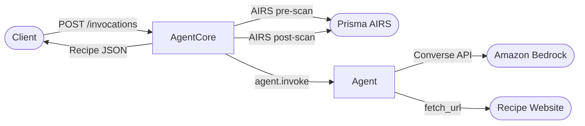

# Part 1: Introduction & Prerequisites

[<- Back to Index](./README.md) | [Next: Agent Architecture ->](./02-agent-architecture-deep-dive.md)

---

## What is an AI Agent?

An AI agent is software that uses a large language model (LLM) as its reasoning engine. Unlike a simple chat interface, an agent can:

- **Use tools** — call functions (HTTP requests, database queries, file operations) to interact with the world
- **Make decisions** — the LLM decides *which* tools to call, *when*, and *how to interpret* results
- **Follow multi-step plans** — chain tool calls together to accomplish complex tasks

The pattern looks like this:

```
User request
  → LLM reads request + system prompt
    → LLM decides to call a tool
      → Tool executes, returns result
        → LLM reads result, decides next step
          → ... (loop until done)
            → LLM produces final answer
```

The framework that orchestrates this loop is called an **agent framework**. This project uses the [Strands Agents SDK](https://github.com/strands-agents/sdk-typescript) (`@strands-agents/sdk`) — it handles the tool-use loop, manages conversation state, and communicates with Amazon Bedrock's Converse API.

## What is Amazon Bedrock AgentCore?

[Bedrock AgentCore](https://aws.amazon.com/bedrock/agentcore/) is an AWS service that runs your agent as a managed container with:

- **VM-level isolation** — each agent runtime gets its own compute environment
- **Built-in HTTP server** — a Fastify server on port 8080 with standard endpoints
- **Managed lifecycle** — AWS handles scaling, health checks, and networking
- **AWS IAM integration** — the container assumes an IAM execution role for Bedrock, Secrets Manager, etc.

Your agent container exposes two endpoints:

| Endpoint | Method | Purpose |
|---|---|---|
| `/ping` | GET | Health check (returns `"pong"`) |
| `/invocations` | POST | Agent invocation (your handler) |

AgentCore handles TLS, load balancing, and routing. You write a handler, package it in a Docker container, and deploy.

## What This Project Builds

The **recipe-extraction-agent** takes a URL, fetches the webpage, and returns structured recipe data as JSON:

```
POST /invocations
{"url": "https://pinchofyum.com/chicken-wontons-in-spicy-chili-sauce"}

→ Returns:
{
  "title": "Chicken Wontons in Spicy Chili Sauce",
  "ingredients": [
    {"quantity": 1, "unit": "lb", "name": "ground chicken", "description": ""},
    ...
  ],
  "preparationSteps": ["Mix filling ingredients...", ...],
  "cookingSteps": ["Boil wontons for 4 minutes...", ...],
  "notes": {
    "servings": "4 servings",
    "cookTime": "10 minutes",
    "prepTime": "30 minutes"
  }
}
```

The agent uses Claude Haiku 4.5 on Bedrock, a custom `fetch_url` tool that extracts text and JSON-LD data from recipe pages, and Zod schemas for response validation.

## Architecture Overview



The full request flow:
1. Client POSTs a URL to `/invocations`
2. Prisma AIRS scans the prompt for security threats (optional)
3. Strands Agent invokes Claude Haiku 4.5 via Bedrock
4. LLM calls `fetch_url` to retrieve the webpage
5. LLM extracts recipe data from the page content
6. `extractJson()` parses the LLM text output
7. `RecipeSchema.parse()` validates the JSON against Zod schemas
8. Prisma AIRS scans the response (optional)
9. Validated recipe JSON is returned to the client

## Prerequisites

Before starting, ensure you have:

| Tool | Version | Purpose |
|---|---|---|
| **Node.js** | 20+ | Runtime |
| **npm** | 10+ | Package manager (ships with Node) |
| **AWS CLI** | v2 | AWS resource management |
| **Docker Desktop** | Latest | Container builds |
| **Git** | Latest | Version control |

**AWS account requirements:**
- An AWS account with Bedrock model access enabled for **Claude Haiku 4.5** in `us-west-2`
- IAM permissions to create roles, ECR repositories, and Secrets Manager secrets
- (For CI/CD) A GitHub account with a fork/clone of this repository

### Verify your tools

```bash
node --version    # v20.x or higher
npm --version     # 10.x or higher
aws --version     # aws-cli/2.x
docker --version  # Docker version 2x.x
```

### Enable Bedrock model access

1. Open the [Amazon Bedrock console](https://console.aws.amazon.com/bedrock/) in `us-west-2`
2. Go to **Model access** in the left sidebar
3. Enable access to **Anthropic → Claude Haiku 4.5**
4. Wait for the status to show "Access granted"

## Local Setup

### 1. Clone and install

```bash
git clone https://github.com/cdot65/aws-bedrock-agentcore-typescript-example.git
cd aws-bedrock-agentcore-typescript-example
npm install
```

The `prepare` script automatically configures git to use the project's pre-commit hooks:

```bash
# This runs automatically during npm install:
git config core.hooksPath .githooks
```

### 2. Configure environment

```bash
cp .env.example .env
```

The `.env.example` file:

```bash
# Prisma AIRS AI Runtime Security
# PRISMA_AIRS_API_KEY is fetched from Secrets Manager in prod.
# Set here for local dev only.
PRISMA_AIRS_API_KEY=
PRISMA_AIRS_PROFILE_NAME=

# AWS Bedrock Agent metadata (optional, for AIRS agent discovery)
BEDROCK_AGENT_ID=
BEDROCK_AGENT_VERSION=1
AWS_ACCOUNT_ID=
AWS_REGION=us-west-2

# AgentCore deployment (set after first deploy, used for --update)
AGENTCORE_RUNTIME_ID=
```

For local development, the only required value is valid AWS credentials with Bedrock access. The Prisma AIRS fields are optional — the agent works without them (see [Part 3](./03-security-with-prisma-airs.md)).

Ensure your AWS credentials are configured:

```bash
aws sts get-caller-identity
```

### 3. Run locally

Start the development server:

```bash
npm run dev
```

This runs `tsx --env-file=.env src/main.ts` — TypeScript execution with hot reload and `.env` loading.

### 4. Test the health check

```bash
curl http://localhost:8080/ping
```

Expected response:

```
"pong"
```

### 5. Test an invocation

```bash
curl -X POST http://localhost:8080/invocations \
  -H "Content-Type: application/json" \
  -H "x-amzn-bedrock-agentcore-runtime-session-id: test-session-1" \
  -d '{"url": "https://pinchofyum.com/chicken-wontons-in-spicy-chili-sauce"}'
```

The response (after 5-9 seconds) will be a structured recipe JSON object:

```json
{
  "title": "Chicken Wontons in Spicy Chili Sauce",
  "ingredients": [
    {
      "quantity": 1,
      "unit": "lb",
      "name": "ground chicken",
      "description": ""
    }
  ],
  "preparationSteps": [
    "Mix the ground chicken with sesame oil, soy sauce, ginger..."
  ],
  "cookingSteps": [
    "Bring a large pot of water to a boil..."
  ],
  "notes": {
    "servings": "4 servings",
    "cookTime": "10 minutes",
    "prepTime": "30 minutes"
  }
}
```

### 6. Run the test suite

```bash
npm test              # 71 tests
npm run test:coverage # with coverage report
npm run typecheck     # TypeScript type checking
npm run check         # Biome lint + format
```

---

[Next: Agent Architecture Deep Dive ->](./02-agent-architecture-deep-dive.md)
