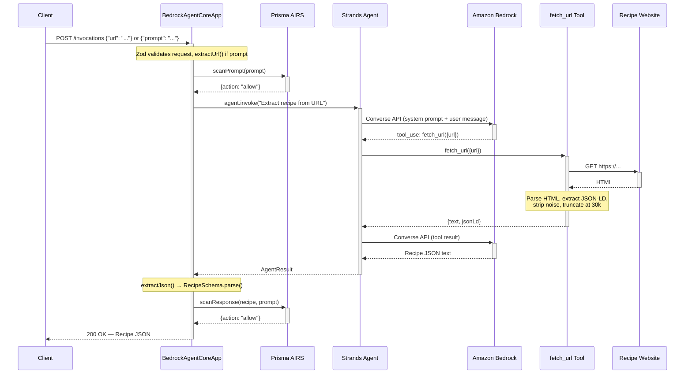

# Part 2: Agent Architecture Deep Dive


This part walks through every layer of the agent — from the entry point through the LLM tool-use loop to response validation.

## Entry Point Chain

```
src/main.ts → src/app.ts → BedrockAgentCoreApp
```

### `src/main.ts` — Bootstrap

The entry point handles one concern: fetching secrets before the server starts.

```typescript
// src/main.ts
import { GetSecretValueCommand, SecretsManagerClient } from "@aws-sdk/client-secrets-manager";

async function bootstrap() {
  const region = process.env.AWS_REGION || "us-west-2";
  let secretSource = "env";

  if (!process.env.PANW_AI_SEC_API_KEY) {
    try {
      const sm = new SecretsManagerClient({ region });
      const secret = await sm.send(
        new GetSecretValueCommand({
          SecretId: "recipe-agent/prisma-airs-api-key",
        }),
      );
      if (secret.SecretString) {
        process.env.PANW_AI_SEC_API_KEY = secret.SecretString;
        secretSource = "secrets-manager";
      }
    } catch (err) {
      console.warn("Secrets Manager unavailable, using env var for PANW_AI_SEC_API_KEY");
      console.warn("  error:", String(err));
    }
  }

  const apiKey = process.env.PANW_AI_SEC_API_KEY || "";
  console.log(
    JSON.stringify({
      msg: "bootstrap",
      secretSource,
      apiKeySet: Boolean(apiKey),
      apiKeyLength: apiKey.length,
      apiKeyPrefix: apiKey.slice(0, 8) || null,
      profileName: process.env.PRISMA_AIRS_PROFILE_NAME || null,
      region,
      bedrockAgentId: process.env.BEDROCK_AGENT_ID || null,
      awsAccountId: process.env.AWS_ACCOUNT_ID || null,
    }),
  );

  // Dynamic import so app.ts module-level init() sees the env var
  const { app } = await import("./app.js");
  app.run();
}

bootstrap();
```

**Key points:**
- Only fetches from Secrets Manager if the env var isn't already set (local dev uses `.env`)
- Tracks `secretSource` (`"env"` vs `"secrets-manager"`) and emits a structured JSON bootstrap log with key diagnostics (key length/prefix, profile name, region, agent ID)
- Fails gracefully — if Secrets Manager is unavailable, the agent runs without AIRS (logs warning + error)
- Uses a **dynamic import** for `app.ts` — the `@cdot65/prisma-airs-sdk` `init()` call runs at module load time, so the API key must be in `process.env` *before* the import
- Calls `app.run()` to start the Fastify server on port 8080

### `src/app.ts` — Agent + Server

This file exports `SYSTEM_PROMPT`, `agent`, `extractUrl()`, `extractJson()`, `airsEnabled`, `processHandler`, and `app`. The separation makes every piece independently testable.

## Model Configuration

```typescript
// src/app.ts
const model = new BedrockModel({
  modelId: "us.anthropic.claude-haiku-4-5-20251001-v1:0",
  region: "us-west-2",
  maxTokens: 4096,
  temperature: 0,
});
```

| Parameter | Value | Why |
|---|---|---|
| `modelId` | `us.anthropic.claude-haiku-4-5-20251001-v1:0` | Fast, cheap, accurate enough for structured extraction |
| `region` | `us-west-2` | Bedrock endpoint region |
| `maxTokens` | `4096` | Sufficient for even large recipe JSON |
| `temperature` | `0` | Deterministic output for consistent JSON formatting |

The model ID uses a **cross-region inference profile** prefix (`us.`) which lets Bedrock route to the nearest available endpoint. The IAM role needs access to both `foundation-model/*` and `inference-profile/*` resources.

## Agent + System Prompt

```typescript
// src/app.ts
export const agent = new Agent({
  model,
  tools: [fetchUrlTool],
  systemPrompt: SYSTEM_PROMPT,
  printer: false,
});
```

The `printer: false` setting disables the SDK's built-in console output — in a server context, we use structured logging instead.

The system prompt (defined at the top of `src/app.ts`) tells the LLM exactly what schema to produce:

```typescript
// src/app.ts
export const SYSTEM_PROMPT = `You are a recipe extraction agent. When given a URL:

1. Use the fetch_url tool to retrieve the webpage content.
2. Analyze the returned text and any JSON-LD data to extract the recipe.
3. Return ONLY a valid JSON object matching this exact schema (no markdown, no explanation):

{
  "title": "string",
  "ingredients": [
    { "quantity": number, "unit": "string", "name": "string", "description": "string" }
  ],
  "preparationSteps": ["string"],
  "cookingSteps": ["string"],
  "notes": {
    "servings": "string or omit",
    "cookTime": "string or omit",
    "prepTime": "string or omit",
    "tips": ["string"] or omit
  }
}

Rules:
- quantity must be a number (convert fractions: ½=0.5, ¼=0.25, ⅓=0.33, ¾=0.75, etc.)
- unit is empty string "" if the ingredient is unitless (e.g. "2 eggs" → unit: "")
- description is empty string "" if no preparation notes exist
- Separate preparation steps (no heat: chopping, mixing, marinating) from cooking steps (involving heat or the actual cook)
- If JSON-LD data is available, prefer it for accuracy but still verify against the page text
- Return ONLY the JSON object, nothing else`;
```

**Design note:** The Strands SDK has a `structuredOutputSchema` parameter, but the TypeScript SDK docs state it's "not supported in TypeScript." The manual approach — system prompt instructions + `extractJson()` parsing — is reliable and fully testable.

## The `fetch_url` Tool

The agent has one tool: `fetch_url`. It fetches a URL, parses the HTML, and returns clean text + any JSON-LD recipe data.

```typescript
// src/tools/fetch-url.ts
export const fetchUrlTool = tool({
  name: "fetch_url",
  description:
    "Fetches a URL and returns the page text content plus any schema.org/Recipe JSON-LD data found.",
  inputSchema: z.object({
    url: z.url().describe("The URL to fetch"),
  }),
  callback: async (input) => {
    const response = await fetch(input.url, {
      headers: {
        "User-Agent": "Mozilla/5.0 ...",
        Accept: "text/html,application/xhtml+xml,...",
        "Accept-Language": "en-US,en;q=0.9",
      },
      redirect: "follow",
    });

    if (!response.ok) {
      return { text: `Error: HTTP ${response.status} ${response.statusText}`, jsonLd: null };
    }

    const html = await response.text();
    const { document } = parseHTML(html);

    // 1. Extract JSON-LD before stripping scripts
    let jsonLd: unknown = null;
    const ldScripts = document.querySelectorAll('script[type="application/ld+json"]');
    for (const script of ldScripts) {
      // Handles direct Recipe, @graph arrays, and top-level arrays
      // ...
    }

    // 2. Strip non-content elements
    for (const selector of STRIP_SELECTORS) {
      for (const el of document.querySelectorAll(selector)) {
        el.remove();
      }
    }

    // 3. Collapse whitespace, truncate at 30k chars
    let text = (document.body?.textContent || "").replace(/\s+/g, " ").trim();
    if (text.length > MAX_TEXT_LENGTH) {
      text = `${text.slice(0, MAX_TEXT_LENGTH)}... [truncated]`;
    }

    return { text, jsonLd: jsonLd ? JSON.stringify(jsonLd) : null };
  },
});
```

**What it does step by step:**

1. **Fetches** the URL with browser-like headers (avoids bot blocking)
2. **Extracts JSON-LD** — many recipe sites embed `schema.org/Recipe` structured data in `<script type="application/ld+json">` tags. This is high-quality structured data.
3. **Strips noise** — removes `script`, `style`, `nav`, `header`, `footer`, `aside`, `noscript`, `iframe` elements
4. **Extracts text** — collapses whitespace, truncates at 30,000 characters

The tool returns both `text` (for the LLM to read) and `jsonLd` (structured data for accuracy). The LLM uses both to produce the final recipe JSON.

**Why linkedom?** The `linkedom` package is ~200KB — jsdom is ~70MB. For server-side HTML parsing where you don't need full browser simulation, linkedom is sufficient and much lighter.

## `extractJson()` — Parsing LLM Output

LLMs don't always return clean JSON. They might wrap it in markdown code blocks, add explanation text, or include trailing commas. `extractJson()` handles this with a three-step fallback chain:

```typescript
// src/app.ts
export function extractJson(text: string): unknown {
  // 1. Try direct parse
  try {
    return JSON.parse(text);
  } catch { /* fall through */ }

  // 2. Try markdown code block: ```json ... ```
  const codeBlockMatch = text.match(/```(?:json)?\s*\n?([\s\S]*?)\n?```/);
  if (codeBlockMatch) {
    try {
      return JSON.parse(codeBlockMatch[1]);
    } catch { /* fall through */ }
  }

  // 3. Try first { ... last }
  const braceStart = text.indexOf("{");
  const braceEnd = text.lastIndexOf("}");
  if (braceStart !== -1 && braceEnd > braceStart) {
    try {
      return JSON.parse(text.slice(braceStart, braceEnd + 1));
    } catch { /* fall through */ }
  }

  throw new Error("Could not extract JSON from agent response");
}
```

This handles the three most common LLM output patterns:
1. Clean JSON (ideal case)
2. JSON wrapped in `` ```json ... ``` `` blocks
3. JSON embedded in explanatory text

## Zod Schemas

The extracted JSON is validated against strict Zod schemas:

```typescript
// src/schemas/recipe.ts
export const IngredientSchema = z.object({
  quantity: z.number().describe("Numeric quantity (e.g. 2, 0.5)"),
  unit: z.string().describe("Unit of measure. Empty string if unitless"),
  name: z.string().describe("Ingredient name"),
  description: z.string().describe("Preparation notes. Empty string if none"),
});

export const RecipeSchema = z.object({
  title: z.string().describe("Recipe title"),
  ingredients: z.array(IngredientSchema).describe("Parsed ingredient list"),
  preparationSteps: z.array(z.string()).describe("Steps before cooking"),
  cookingSteps: z.array(z.string()).describe("Steps involving heat"),
  notes: z.object({
    servings: z.string().optional(),
    cookTime: z.string().optional(),
    prepTime: z.string().optional(),
    tips: z.array(z.string()).optional(),
  }).describe("Recipe metadata and tips"),
});

export type Ingredient = z.infer<typeof IngredientSchema>;
export type Recipe = z.infer<typeof RecipeSchema>;
```

If the LLM output doesn't match the schema, `RecipeSchema.parse()` throws with detailed error messages — this acts as a safety net against hallucinated or malformed responses.

## `extractUrl()` — Parsing URLs from Plain Text

The handler accepts both `{"url": "..."}` and `{"prompt": "natural language with URL"}`. The `extractUrl()` function extracts a URL from freeform text:

```typescript
// src/app.ts
const URL_REGEX = /https?:\/\/[^\s"'<>]+/;

export function extractUrl(text: string): string | null {
  const match = text.match(URL_REGEX);
  return match ? match[0] : null;
}
```

This enables compatibility with clients that send plain text prompts (e.g., LiteLLM) instead of structured JSON.

## `processHandler` — The Request Flow

The handler ties everything together:

```typescript
// src/app.ts (simplified)
export const processHandler = async (
  request: { url?: string; prompt?: string },
  context: { sessionId: string; log: { info; warn; error } },
) => {
  // Accept {"url": "..."} or {"prompt": "natural language with URL"}
  let url = request.url;
  if (!url && request.prompt) {
    url = extractUrl(request.prompt) ?? undefined;
  }
  if (!url) {
    return {
      error: "bad_request",
      message: 'No URL found in request. Provide {"url": "..."} or a prompt containing a URL.',
    };
  }

  const prompt = `Extract the recipe from this URL: ${url}`;
  context.log.info({ url, sessionId: context.sessionId }, "Extracting recipe");

  // 1. Pre-scan: check inbound prompt (uses @cdot65/prisma-airs-sdk Scanner)
  if (scanner) {
    const metadata = buildMetadata();
    let promptScan: ScanResponse | undefined;
    try {
      promptScan = await scanner.syncScan(
        { profile_name: airsProfileName },
        new Content({ prompt }),
        { sessionId: context.sessionId, metadata },
      );
    } catch (err) {
      context.log.error({ ...scanErrorFields(err) }, "AIRS prompt scan failed, proceeding unscanned");
    }
    if (promptScan?.action === "block") {
      return { error: "blocked", message: "Request blocked by Prisma AIRS security.", ... };
    }
  }

  // 2. Invoke the agent
  const result: AgentResult = await agent.invoke(prompt);

  // 3. Parse + validate
  const parsed = extractJson(result.toString());
  const recipe = RecipeSchema.parse(parsed);

  // 4. Post-scan: check outbound response
  if (scanner) {
    let responseScan: ScanResponse | undefined;
    try {
      responseScan = await scanner.syncScan(
        { profile_name: airsProfileName },
        new Content({ prompt, response: JSON.stringify(recipe) }),
        { sessionId: context.sessionId, metadata: buildMetadata() },
      );
    } catch (err) {
      context.log.error({ ...scanErrorFields(err) }, "AIRS response scan failed, proceeding unscanned");
    }
    if (responseScan?.action === "block") {
      return { error: "blocked", message: "Response blocked by Prisma AIRS security.", ... };
    }
  }

  return recipe;
};
```

The AIRS integration uses the `@cdot65/prisma-airs-sdk` package — see [Part 3: Security with Prisma AIRS](./03-security-with-prisma-airs.md) for the full SDK setup details including `init()`, `Scanner`, `Content`, and `buildMetadata()`.

## BedrockAgentCoreApp Wiring

Finally, the app is created and exported:

```typescript
// src/app.ts
export const app = new BedrockAgentCoreApp({
  config: { logging: { options: { stream: logStream } } },
  invocationHandler: {
    requestSchema: z.object({
      url: z.string().url().describe("URL of the recipe page to extract").optional(),
      prompt: z.string().describe("Natural language prompt containing a recipe URL").optional(),
    }),
    process: processHandler,
  },
});
```

- `requestSchema` validates incoming POST bodies — accepts either a `url` or a `prompt` containing a URL
- `process` is called for every `/invocations` request
- `config.logging.options.stream` routes Pino logs to stdout + CloudWatch (see [Part 4](./04-observability-cloudwatch-logs.md))

## Request Flow Sequence



