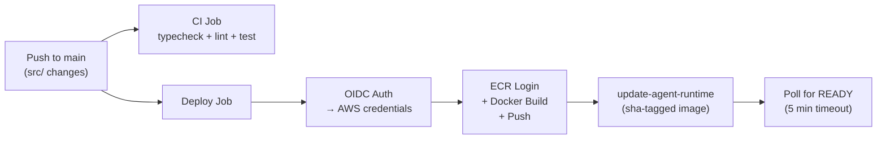

# Part 8: CI/CD with GitHub Actions

[<- Back to Index](./README.md) | [Previous: Deploying](./07-deploying-to-agentcore.md) | [Next: Teardown ->](./09-teardown.md)

---

## Overview

The project has two GitHub Actions workflows:

| Workflow | Trigger | Purpose |
|---|---|---|
| **CI** (`.github/workflows/ci.yml`) | PR to main, push to main | Typecheck, lint, test |
| **Deploy** (`.github/workflows/deploy.yml`) | Push to main (source changes) | Build, push to ECR, update runtime |

Plus a local pre-commit hook that catches issues before they reach CI.

## Local Quality Gates

### Pre-commit Hook

`.githooks/pre-commit` runs three checks before every commit:

```bash
#!/usr/bin/env bash
set -euo pipefail

echo "==> typecheck"
npm run typecheck

echo "==> lint + format"
npm run check

echo "==> test"
npm test
```

This is configured automatically during `npm install` via the `prepare` script:

```json
{
  "scripts": {
    "prepare": "git config core.hooksPath .githooks"
  }
}
```

If any check fails, the commit is rejected. Fix the issue, re-stage, and commit again.

## CI Workflow

`.github/workflows/ci.yml` — runs on every PR and push to main:

```yaml
name: CI

on:
  pull_request:
    branches: [main]
  push:
    branches: [main]

jobs:
  check:
    runs-on: ubuntu-latest
    steps:
      - uses: actions/checkout@v4

      - uses: actions/setup-node@v4
        with:
          node-version: 22
          cache: npm

      - run: npm ci

      - name: Typecheck
        run: npm run typecheck

      - name: Lint & format
        run: npm run check

      - name: Test
        run: npm run test:coverage
```

This mirrors the pre-commit hook but runs in a clean environment and includes coverage reporting. The CI job uses Node 22 (latest LTS) for validation — the runtime uses Node 20 (matching the Docker image).

## GitHub OIDC Setup

The deploy workflow uses **GitHub OIDC** to authenticate with AWS — no long-lived credentials needed. GitHub Actions requests a short-lived token from AWS STS, scoped to your repository.

### Prerequisites

1. A GitHub OIDC identity provider must exist in your AWS account. If it doesn't:

```bash
aws iam create-open-id-connect-provider \
  --url https://token.actions.githubusercontent.com \
  --client-id-list sts.amazonaws.com \
  --thumbprint-list 6938fd4d98bab03faadb97b34396831e3780aea1
```

2. The AgentCore runtime must already be created (see [Part 7](./07-deploying-to-agentcore.md)).

### `scripts/setup-github-iam.sh`

This script creates the `github-actions-recipe-agent` IAM role:

```bash
#!/usr/bin/env bash
set -euo pipefail

REGION="${AWS_REGION:-us-west-2}"
ACCOUNT_ID=$(aws sts get-caller-identity --query Account --output text)
ROLE_NAME="github-actions-recipe-agent"
REPO="cdot65/aws-bedrock-agentcore-typescript-example"
ECR_REPO="recipe-extraction-agent"
RUNTIME_ID="${AGENTCORE_RUNTIME_ID:-recipe_extraction_agent-wkubdE7YBy}"
```

### Trust Policy

```json
{
  "Version": "2012-10-17",
  "Statement": [{
    "Effect": "Allow",
    "Principal": {
      "Federated": "arn:aws:iam::ACCOUNT_ID:oidc-provider/token.actions.githubusercontent.com"
    },
    "Action": "sts:AssumeRoleWithWebIdentity",
    "Condition": {
      "StringEquals": {
        "token.actions.githubusercontent.com:aud": "sts.amazonaws.com"
      },
      "StringLike": {
        "token.actions.githubusercontent.com:sub": "repo:cdot65/aws-bedrock-agentcore-typescript-example:*"
      }
    }
  }]
}
```

The `StringLike` condition scopes the role to your specific GitHub repository. Only workflows running from this repo can assume the role.

### ECR Push Policy

```json
{
  "Version": "2012-10-17",
  "Statement": [
    {
      "Effect": "Allow",
      "Action": "ecr:GetAuthorizationToken",
      "Resource": "*"
    },
    {
      "Effect": "Allow",
      "Action": [
        "ecr:BatchCheckLayerAvailability",
        "ecr:GetDownloadUrlForLayer",
        "ecr:BatchGetImage",
        "ecr:PutImage",
        "ecr:InitiateLayerUpload",
        "ecr:UploadLayerPart",
        "ecr:CompleteLayerUpload"
      ],
      "Resource": "arn:aws:ecr:us-west-2:ACCOUNT_ID:repository/recipe-extraction-agent"
    }
  ]
}
```

### AgentCore Deploy Policy

```json
{
  "Version": "2012-10-17",
  "Statement": [
    {
      "Effect": "Allow",
      "Action": [
        "bedrock-agentcore:UpdateAgentRuntime",
        "bedrock-agentcore:GetAgentRuntime"
      ],
      "Resource": "arn:aws:bedrock-agentcore:us-west-2:ACCOUNT_ID:runtime/RUNTIME_ID"
    },
    {
      "Effect": "Allow",
      "Action": "iam:PassRole",
      "Resource": "arn:aws:iam::ACCOUNT_ID:role/BedrockAgentCoreRecipeAgent",
      "Condition": {
        "StringEquals": {
          "iam:PassedToService": "bedrock-agentcore.amazonaws.com"
        }
      }
    }
  ]
}
```

The `iam:PassRole` permission is required because `update-agent-runtime` passes the execution role to AgentCore.

### Run the setup script

```bash
AGENTCORE_RUNTIME_ID=your-runtime-id scripts/setup-github-iam.sh
```

The script outputs the commands to set GitHub secrets:

```
Set GitHub repo secrets:
  gh secret set AWS_ROLE_ARN -b "arn:aws:iam::123456789012:role/github-actions-recipe-agent"
  gh secret set AGENTCORE_RUNTIME_ID -b "your-runtime-id"
  gh secret set AGENTCORE_ROLE_ARN -b "arn:aws:iam::123456789012:role/BedrockAgentCoreRecipeAgent"
```

## GitHub Secrets

Four secrets are needed in your repository:

| Secret | Value | Purpose |
|---|---|---|
| `AWS_ROLE_ARN` | `arn:aws:iam::...:role/github-actions-recipe-agent` | OIDC role for CI/CD |
| `AGENTCORE_RUNTIME_ID` | Runtime ID from first deploy | Target runtime to update |
| `AGENTCORE_ROLE_ARN` | `arn:aws:iam::...:role/BedrockAgentCoreRecipeAgent` | Execution role passed to runtime |
| `PRISMA_AIRS_PROFILE_NAME` | AIRS security profile name | Prisma AIRS profile for prompt/response scanning |

Set them with the `gh` CLI:

```bash
gh secret set AWS_ROLE_ARN -b "arn:aws:iam::123456789012:role/github-actions-recipe-agent"
gh secret set AGENTCORE_RUNTIME_ID -b "your-runtime-id"
gh secret set AGENTCORE_ROLE_ARN -b "arn:aws:iam::123456789012:role/BedrockAgentCoreRecipeAgent"
gh secret set PRISMA_AIRS_PROFILE_NAME -b "your-airs-profile-name"
```

## Deploy Workflow

`.github/workflows/deploy.yml`:

```yaml
name: Deploy to AgentCore

on:
  push:
    branches: [main]
    paths:
      - "src/**"
      - "package.json"
      - "package-lock.json"
      - "Dockerfile"
      - "tsconfig.json"
  workflow_dispatch:

env:
  AWS_REGION: us-west-2
  ECR_REGISTRY: 585768170262.dkr.ecr.us-west-2.amazonaws.com
  ECR_REPOSITORY: recipe-extraction-agent

permissions:
  id-token: write
  contents: read
```

### Triggers

- **Push to main** — only when source files, dependencies, or the Dockerfile change (via `paths` filter). README changes don't trigger a deploy.
- **Manual dispatch** — `workflow_dispatch` lets you trigger from the GitHub Actions UI.

### Permissions

`id-token: write` is required for GitHub OIDC — it allows the workflow to request a token from AWS STS.

### Build & Push Steps

```yaml
steps:
  - uses: actions/checkout@v4

  - name: Configure AWS credentials
    uses: aws-actions/configure-aws-credentials@v4
    with:
      role-to-assume: ${{ secrets.AWS_ROLE_ARN }}
      aws-region: ${{ env.AWS_REGION }}

  - name: Login to Amazon ECR
    uses: aws-actions/amazon-ecr-login@v2

  - name: Set up Docker Buildx
    uses: docker/setup-buildx-action@v3

  - name: Build and push
    uses: docker/build-push-action@v6
    with:
      context: .
      push: true
      platforms: linux/arm64
      tags: |
        ${{ env.ECR_REGISTRY }}/${{ env.ECR_REPOSITORY }}:latest
        ${{ env.ECR_REGISTRY }}/${{ env.ECR_REPOSITORY }}:sha-${{ github.sha }}
      cache-from: type=gha
      cache-to: type=gha,mode=max
```

**Image tagging:** Each build produces two tags:
- `latest` — always points to the newest image
- `sha-{commit}` — immutable tag tied to the exact commit

**Build caching:** `cache-from: type=gha` uses GitHub Actions cache for Docker layer caching. Subsequent builds only rebuild changed layers.

### Update Runtime

```yaml
  - name: Update AgentCore runtime
    run: |
      aws bedrock-agentcore-control update-agent-runtime \
        --agent-runtime-id "${{ secrets.AGENTCORE_RUNTIME_ID }}" \
        --agent-runtime-artifact "{\"containerConfiguration\":{\"containerUri\":\"${ECR_REGISTRY}/${ECR_REPOSITORY}:sha-${GITHUB_SHA}\"}}" \
        --role-arn "${{ secrets.AGENTCORE_ROLE_ARN }}" \
        --network-configuration '{"networkMode":"PUBLIC"}' \
        --protocol-configuration '{"serverProtocol":"HTTP"}' \
        --environment-variables "{\"AWS_REGION\":\"${AWS_REGION}\",...}" \
        --region "${AWS_REGION}"
```

Note: The deploy workflow uses the `sha-{commit}` tag (not `latest`) for the container URI. This ensures the runtime pulls the exact image that was just built.

### Poll for READY

```yaml
  - name: Wait for READY status
    timeout-minutes: 5
    run: |
      for i in $(seq 1 30); do
        STATUS=$(aws bedrock-agentcore-control get-agent-runtime \
          --agent-runtime-id "${{ secrets.AGENTCORE_RUNTIME_ID }}" \
          --region "${AWS_REGION}" \
          --query 'status' --output text 2>/dev/null || echo "UNKNOWN")
        echo "Status: ${STATUS} (attempt ${i}/30)"
        if [[ "${STATUS}" == "READY" ]]; then
          echo "Runtime is READY!"
          exit 0
        elif [[ "${STATUS}" == "FAILED" ]]; then
          echo "Runtime FAILED" >&2
          exit 1
        fi
        sleep 10
      done
      echo "Timeout waiting for READY" >&2
      exit 1
```

## End-to-End Flow



Both CI and Deploy run in parallel on push to main. CI validates code quality; Deploy builds and ships to AgentCore.

---

[Next: Teardown ->](./09-teardown.md)
