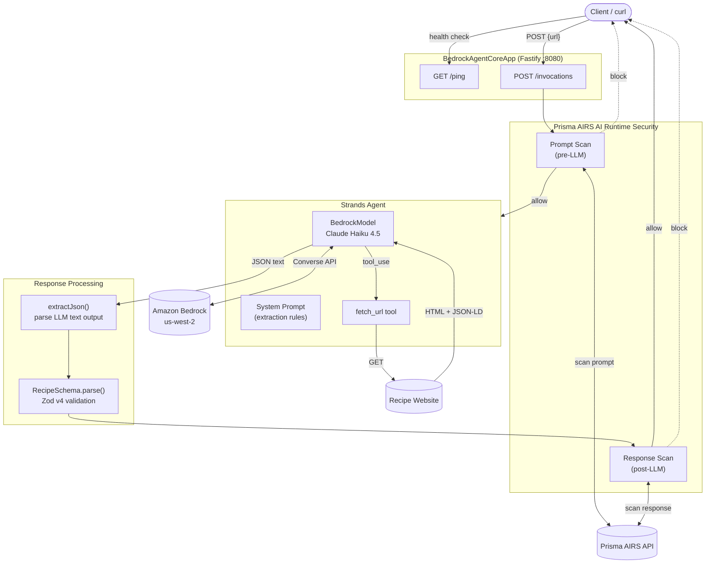

# Deploying an AI Agent to AWS Bedrock AgentCore

A nine-part guide to building, securing, and deploying a TypeScript AI agent on [Amazon Bedrock AgentCore](https://aws.amazon.com/bedrock/agentcore/) — from local development to fully automated CI/CD.

This series uses the **recipe-extraction-agent** as its running example: a production-ready agent that takes a URL, fetches the webpage, and returns structured recipe JSON using Claude Haiku 4.5.

## Architecture

## Guide Contents

1. [Introduction & Prerequisites](./01-introduction-and-prerequisites.md) — AI agent primer, project overview, local setup
2. [Agent Architecture Deep Dive](./02-agent-architecture-deep-dive.md) — entry points, model config, tools, schemas, request flow
3. [Security with Prisma AIRS](./03-security-with-prisma-airs.md) — AI runtime security, prompt/response scanning, fail-open design
4. [Observability: CloudWatch Logs](./04-observability-cloudwatch-logs.md) — custom log shipping, Pino integration, tee streams
5. [Docker & Container Build](./05-docker-and-container-build.md) — ARM64 multi-stage build, local testing
6. [AWS Infrastructure Setup](./06-aws-infrastructure-setup.md) — IAM roles, ECR, Secrets Manager, env vars
7. [Deploying to AgentCore](./07-deploying-to-agentcore.md) — first deploy, updates, polling, troubleshooting
8. [CI/CD with GitHub Actions](./08-ci-cd-with-github-actions.md) — OIDC auth, automated builds, deploy pipeline
9. [Teardown](./09-teardown.md) — clean removal of all AWS resources
