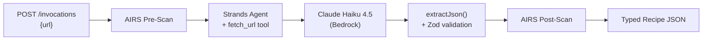

{ .hero-logo }

# Recipe Extraction Agent

**TypeScript agent on AWS Bedrock AgentCore**

---

Give it a URL, get back a strongly-typed `Recipe` JSON object. Built on [Bedrock AgentCore](https://github.com/aws/bedrock-agentcore-sdk-typescript) + [Strands Agents SDK](https://github.com/strands-agents/sdk-typescript), deployed to AWS with VM-level isolation and optional AI runtime security via [Prisma AIRS](https://docs.paloaltonetworks.com/ai-runtime-security) (Strata Cloud Manager).

- :material-web:{ .lg .middle } **URL to Structured Data**

    ***

    Point the agent at any recipe URL — it fetches the page, extracts JSON-LD and text, and returns a validated Recipe object with ingredients, steps, and notes.

- :material-shield-check:{ .lg .middle } **AI Security Scanning**

    ***

    Prisma AIRS (Strata Cloud Manager) scans data from external sources — prompt injection, URL categorization, agent security, DLP, and more — preventing agents from acting on untrusted data. Fail-open by default.

- :material-cloud-outline:{ .lg .middle } **Bedrock AgentCore Runtime**

    ***

    Deployed as an ARM64 Docker container with VM-level isolation, auto-scaling, and a managed Fastify server on port 8080.

- :material-eye-outline:{ .lg .middle } **Full Observability**

    ***

    Custom CloudWatch Logs streaming from inside the container — structured JSON logs for every request, agent invocation, and security scan.

- :material-test-tube:{ .lg .middle } **100% Test Coverage**

    ***

    133 tests across 6 suites with enforced coverage thresholds. Pre-commit hooks and GitHub Actions CI gate every change.

- :material-rocket-launch:{ .lg .middle } **Automated CI/CD**

    ***

    GitHub Actions with OIDC auth — push to main builds the image, pushes to ECR, and updates the AgentCore runtime automatically.

---

## Request Flow

---

## Get Started

- :material-download:{ .lg .middle } **Prerequisites**

    ***

    Node.js 20+, AWS credentials, and a Bedrock-enabled account.

    [:octicons-arrow-right-24: Prerequisites](getting-started/prerequisites.md)

- :material-play-circle:{ .lg .middle } **Quick Start**

    ***

    Install, configure, and extract your first recipe in 2 minutes.

    [:octicons-arrow-right-24: Quick Start](getting-started/quick-start.md)

- :material-cog:{ .lg .middle } **Configuration**

    ***

    Environment variables, AIRS setup, and CloudWatch logging.

    [:octicons-arrow-right-24: Configuration](getting-started/configuration.md)

- :material-book-open-variant:{ .lg .middle } **Architecture**

    ***

    System design, request flow diagrams, and key design decisions.

    [:octicons-arrow-right-24: Architecture](architecture/overview.md)

